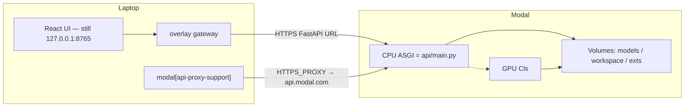

# MODAL-REMOTE-BACKEND

- Status: proposed
- Date: 2026-08-15

## Decision

Keep the Modly Electron / React desktop app on the user's machine, and move
the FastAPI + model-extension runtime to Modal. Local mode stays the default.

**Upstream compatibility is a hard requirement.** Remote mode is an overlay,
not a fork of the renderer:

- `appStore.initApp()` still calls `window.electron.python.start()`.
- `useApi()` still uses `apiUrl` from `app.info()`, which stays
  `http://127.0.0.1:8765`.
- Generate / Workflow / Viewer / Models pages are not rewritten.
- `python-bridge.start()` either launches local uvicorn **or** a local
  gateway that proxies 8765 → Modal.
- New FastAPI routes added by upstream are forwarded automatically.
- Only local-path assumptions (`import-by-path`, workspace cache,
  disk-scanning IPC) are translated in the overlay.

When lightningpixel/modly adds a feature that talks HTTP through `apiUrl`
or `API_BASE_URL`, a merge should pick it up with no Modal-specific edit.
Features that invent a new “scan the local models folder” IPC still need a
one-line shim in `ipc-handlers.ts`.

This is **not** "change `apiUrl` in the renderer and ship". CodeGraph
2026-08-15 (this tree 196 files / 2,617 nodes / 6,517 edges; upstream
`dev` without Modal 179 / 2,496 / 6,318) plus a source pass show eight
coupling surfaces. The overlay concentrates those surfaces in Electron
main + additive FastAPI routes. See `docs/upstream-updates.md`.

## Context

Today the desktop app owns both UI and compute:

```
Electron main
  python-bridge.ts  →  uvicorn main:app 127.0.0.1:8765
    MODELS_DIR / WORKSPACE_DIR / EXTENSIONS_DIR from settings-store
  ipc-handlers.ts   →  extensions install, model download, setup, FS
Renderer
  appStore.initApp() → window.electron.python.start()
  useApi()           → axios.create({ baseURL: apiUrl })
  ModelsPage         → window.electron.model.*  (local disk + hardcoded 127.0.0.1)
  extensionsStore    → window.electron.extensions.* (local folders + setup.py)
```

`useApi.ts` is already backend-addressable. Almost everything else that
touches models, extensions, or workspace files still goes through Electron IPC
and assumes the FastAPI process shares the same filesystem.

## What stays local

- Generate page, model-parameter UI, Workflow canvas, 3D / splat viewers
- Axios generate / poll / cancel / optimize (still `http://127.0.0.1:8765`)
- Workflow JSON, For-Each folder walks, Image / Load-3D-Mesh file pickers
- Built-in **process** nodes (`mesh-optimizer`, `mesh-exporter`, smoother,
  remesher, repair) — these run in Electron workers / local Python, not in
  `GeneratorRegistry`
- Ollama agent chat (it hardcodes `http://localhost:8765` and talks to a
  local Ollama)

## What moves to Modal

- FastAPI (`api/main.py` and routers)
- Model-extension registry + isolated venvs (`ExtensionProcess` / `runner.py`)
- HuggingFace weight downloads
- Generated GLB / splat workspace
- GPU inference (TRELLIS.2, Hunyuan, …)

## Target topology

Local CLI install is `modal[api-proxy-support]` so `modal serve/deploy`
can use `HTTPS_PROXY` / `ALL_PROXY`. That extra is laptop-only.



Do **not** put the ASGI app on a GPU container. Polling `/generate/status`
every second would pin an L40S. CPU web + GPU worker is the cost model that
matches this codebase's job loop.

## Eight change surfaces

### 1. Backend mode (settings + first-run, **not** `appStore.apiUrl`)

`initApp` always calls `window.electron.python.start()`. That call stays.
`app:info` still returns `http://127.0.0.1:8765`. Remote mode only changes
what listens on that port:

- persist `backendMode: 'local' | 'remote'` and `remoteApiUrl`
- `setup:check` reports `needed: false` so first-run Python install is skipped
- `python-bridge.start()` launches the localhost gateway instead of uvicorn
- file pickers stay local; bytes are uploaded when a host path would otherwise
  be sent to Modal

Do **not** point the renderer at the Modal URL. That would fork every future
upstream UI change.

### 2. Electron main still hardcodes `127.0.0.1:8765` — keep it

Those call sites are a feature of the overlay, not a bug. HTTP through
`API_BASE_URL` / `PYTHON_API_URL` hits the gateway and is forwarded.

Only **disk-scan** IPC needs a shim (already in `ipc-handlers.ts`):

| Call site | Overlay action |
|-----------|----------------|
| `model:isDownloaded` / `listDownloaded` / `delete` | `GET /model/all` / `POST /model/delete` |
| `extensions:list` | builtins + `GET /extensions/catalog` |
| `extensions:installFromGitHub` | `POST /extensions/install-from-github` |
| `setup:check` | skip local venv when remote |
| `model:cancelDownload` | do not `rm` the laptop models dir |

`model:download`, export, HF token, and `/extensions/reload` keep using
`127.0.0.1:8765` and therefore Modal, with no extra URL plumbing.

### 3. Extension install is Electron-owned, not FastAPI-owned

`/extensions/setup/{id}` exists, but the real installer is
`ipc-handlers.ts` (`extensions:installFromGitHub`): download tarball →
extract → validate → atomic swap → run `setup.py` with local GPU SM →
POST `/extensions/reload`.

`extensionsStore` and `ModelsPage` never talk to FastAPI for catalog.

Remote policy:

- **Official model extensions**: bake into the Modal Image (or a committed
  Volume snapshot). No runtime `setup.py` on a laptop.
- **User-installed model extensions**: optional later; clone + setup on a
  Modal CPU function writing the extensions Volume. Do not do this in v1.
- **Process extensions**: stay local. They are CPU mesh tools and need
  local paths.

Add `GET /extensions/catalog` on FastAPI so remote UI can list what the
cloud registry actually loaded, instead of lying with a local folder scan.

### 4. Model weights: Volume, not `~/.modly/models`

`ModelsPage.refreshInstalledIds` calls `window.electron.model.isDownloaded`,
which stats the local models directory. `downloadModelFromHF` streams SSE
from local FastAPI into that same directory.

Remote:

- download target = Modal Volume `/modly/models/{model_id}`
- "installed?" = `GET /model/all` (`generator_registry.all_status()`)
- download button = SSE against the **remote** `/model/hf-download`
- delete / pause / cancel = remote endpoints, not `rm` on the laptop

HF token stays in Electron settings and is sent as the existing query
param, or stored as a Modal Secret. Never commit tokens.

### 5. Path split: local FS vs remote workspace

Three different path languages already exist:

| Kind | Example | Who can read it |
|------|---------|-----------------|
| Local absolute | `C:\Users\…\cat.png` | Electron `fs:*` only |
| Workspace-relative | `Default/mesh.glb` | FastAPI `WORKSPACE_DIR` |
| HTTP artifact | `/workspace/Default/mesh.glb` | Viewer via `apiUrl + url` |

`import-by-path` (`optimize.py:397`) opens `Path(body.path)` **on the
server**. A laptop path sent to Modal 404s. `serve-file` then serves that
absolute path — fine on localhost, a path-traversal risk on a public URL.

`workflowRunStore` after a model node does
`nodeInputPath = workspaceDir + rel`. The next **process** node feeds that
local path into `extensions.runProcess`. If the GLB only exists on Modal,
local process nodes have nothing to open.

v1 rule:

- **Into Modal**: always upload bytes (`multipart`), never a host path
- **Out of Modal**: always `/workspace/...` HTTP URLs for the viewer
- **Process nodes**: download the GLB to a local temp (or keep a small
  local workspace cache) before `runProcess`
- Replace `import-by-path` with `import` (upload) when `backendMode === 'remote'`
- Lock `serve-file` to `WORKSPACE_DIR` (needed even for local, required for remote)

### 6. In-memory jobs will lose polls across containers

`api/routers/generation.py` stores `_jobs` in a process dict. Modal may
route `POST /generate/from-image` and `GET /generate/status/{id}` to
different containers.

v1: `modal.Dict` (or a JSON file on the workspace Volume) for job records.
The GPU worker updates the Dict; the CPU ASGI only reads it.

### 7. Auth — the current API is bind-to-localhost

CORS is `allow_origins=["*"]`. There is no bearer check. That is safe only
because uvicorn binds `127.0.0.1`. A Modal `.modal.run` URL is public.

Require `Authorization: Bearer <token>` (Modal Secret) on every route
except `/health`. Electron / axios attach it in remote mode. Also enable
`requires_proxy_auth=True` on the ASGI decorator if the workspace should
stay private to the Modal account.

`/optimize/serve-file?path=` must not accept arbitrary absolute paths.

### 8. Agent and asset library stay out of v1 remote

- `api/routers/agent.py` hardcodes `MODLY_API = "http://localhost:8765"`
- Asset library IPC only allows `Workflows/` and `Exports/` under the
  **local** workspace

Leave both on local backend. Remote mode hides or no-ops them.

## Modal layout

Three Volumes:

| Volume | Mount | Role |
|--------|-------|------|
| `modly-models` | `/modly/models` | HF weights (write-once, read-many) |
| `modly-workspace` | `/modly/workspace` | generated GLB / splat |
| `modly-extensions` | `/modly/extensions` | official model extension checkouts + venvs |

Two functions:

1. **CPU ASGI** — existing FastAPI, `modal.Dict` job store, Volume mounts,
   no GPU, `scaledown_window` **8s**, `min_containers=0`, `buffer_containers=0`.
   The desktop gateway answers `/health` locally so opening the app does not
   keep this container warm.
2. **GPU Cls** — default `gpu=["L40S"]` only (set `MODLY_GPU` for anything
   else; never a silent A100 fallback). After a **successful** generate, linger
   **60s** (Settings can override) with weights still loaded so the next click
   does not reload Hunyuan.
   Cancel / timeout drop the pool in **2s**. `min_containers=0`, memory snapshot
   after `modal deploy`. `@modal.enter` initializes the registry; `generate()`
   loads weights. Do not add `min_containers=1` unless you are choosing to pay
   for a warm GPU.

Bake official extensions with CPU hydrate (`hydrate_official_extensions` +
`hydrate_official_models`) and run `setup.py` on GPU only. Extension
`setup.py` already keys off GPU SM; on Modal, detect SM inside the GPU
container (`torch.cuda.get_device_capability`).

`api/requirements.txt` is the **host** API (fastapi, trimesh, huggingface_hub).
Torch / CUDA live in each extension venv, same as today. Do not pip-install
torch into the ASGI image.

## Implementation order

1. **Modal skeleton** — wrap `api/main.py` with `@modal.asgi_app`, Volumes,
   health check. No frontend change.
2. **Overlay** — settings + localhost 8765 gateway + disk-scan IPC shims.
   Renderer / `useApi` / Generate stay untouched.
3. **Catalog + prebaked official extensions** — Volume bake; catalog is
   already consumed by the `extensions:list` shim.
4. **Upload import + workspace cache** — already in the gateway
   (`import-by-path` → multipart, `/workspace` prefetch).
5. **Job Dict + GPU worker split + bearer auth**.

Do not start at (5). A CPU-only Modal deploy that returns `/health` through
`http://127.0.0.1:8765` is the first proof the overlay works.

## Risks

- Cold start of a Hunyuan / TRELLIS venv on L40S can be tens of seconds
  even with a memory snapshot. Prebake venvs + weights on Volumes via CPU
  hydrate; do not download HuggingFace on the GPU. Use `@modal.enter` so
  the registry is snapshotted, not re-imported every request.
- Volume writes need `volume.commit()` after downloads, or the next
  container will not see the weights.
- `pymeshlab` / native optimize deps must be in the CPU image, not only
  in extension venvs.
- Leaked Modal tokens must be rotated. Tokens never go in git, settings
  committed to the repo, or `environment.json`.
