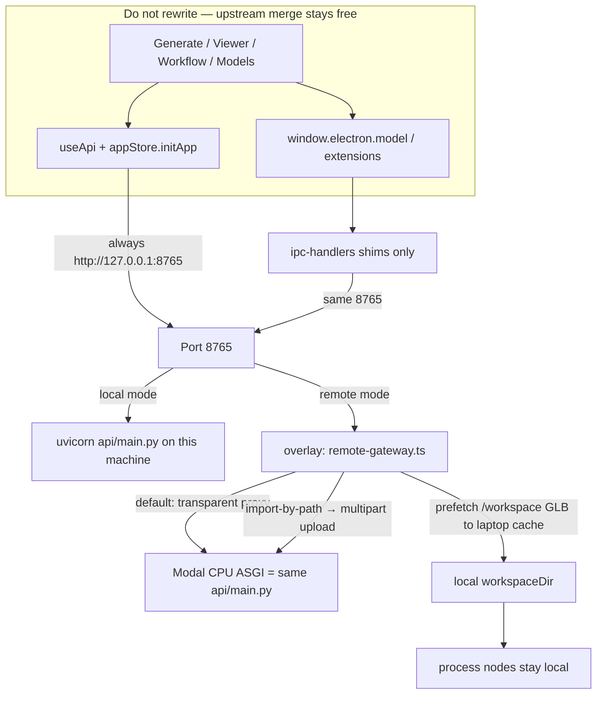
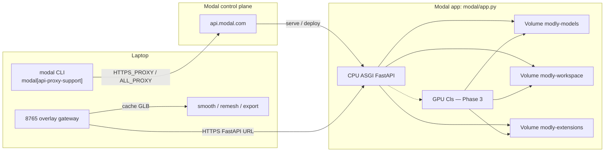

# Upstream compatibility (Modal overlay)

**Overlay** = a layer in front of an unchanged app. The renderer still
thinks FastAPI lives at `http://127.0.0.1:8765`. Remote mode only swaps
*who listens on that port* (uvicorn → local gateway). Modal wraps the
same `api/main.py`; it does not fork Generate / `useApi` / Models.

Two different “proxies” — do not mix them:

| Proxy | Where | Job |
|---|---|---|
| `modal[api-proxy-support]` | Laptop CLI | `modal serve/deploy` → `api.modal.com` via `HTTPS_PROXY` / `ALL_PROXY` |
| Electron overlay gateway | Laptop port 8765 | Modly UI → Modal FastAPI `https://….modal.run` |





Modly’s renderer (`src/`) and most Electron IPC stay pointed at `http://127.0.0.1:8765`.

When `backendMode` is `remote` (or `MODLY_REMOTE_API_URL` is set), Electron starts a **localhost gateway** on that same port instead of uvicorn. The gateway:

1. **Proxies** almost every HTTP request to the Modal FastAPI URL (new upstream routes work with no renderer change).
2. **Translates** the few host-path operations (`/optimize/import-by-path`, `/workspace/...` prefetch for process nodes).
3. **Shims** a small set of IPC handlers that scan disk (`model:isDownloaded`, `extensions:list`, first-run `setup:check`).

## What you do **not** change when lightningpixel/modly adds a feature

| Upstream change | Overlay action |
|---|---|
| New FastAPI route used by `useApi()` | None — gateway proxies it |
| New Generate / Viewer / Workflow UI | None — still talks to 8765 |
| New job type that writes `/workspace/...` | None if the UI reads via HTTP; process nodes get prefetch |
| New “scan local models folder” IPC | Add one shim in `electron/main/ipc-handlers.ts` |
| New host-absolute path POST | Add one translator in `remote-gateway.ts` |

Do **not** rewrite `appStore`, `useApi`, Generate, Viewer, or Workflow to know about Modal.

This is how a merge from `lightningpixel/modly` stays cheap: HTTP features
are free; only new “scan this laptop folder” IPC or host-absolute path POSTs
need a one-place overlay edit.

## Settings

- `backendMode`: `local` (default) or `remote`
- `remoteApiUrl`: Modal FastAPI URL (`https://….modal.run`)
- `remoteApiToken`: optional Bearer token (also `MODLY_REMOTE_API_TOKEN`)

Environment override (no settings UI needed):

```bash
export MODLY_REMOTE_API_URL=https://your-app.modal.run
export MODLY_REMOTE_API_TOKEN=...   # optional
```

Restart the app after changing backend mode.

## Local-only features (never send to Modal)

- Agent (Ollama + local filesystem)
- Asset Library (local `~/Modly`)
- Process nodes (smooth / remesh / optimize / export) — they run on the Mac after the gateway caches the GLB
